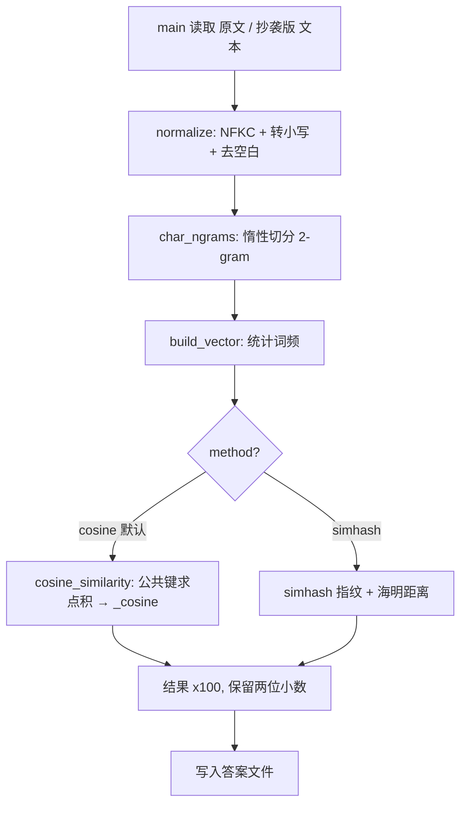
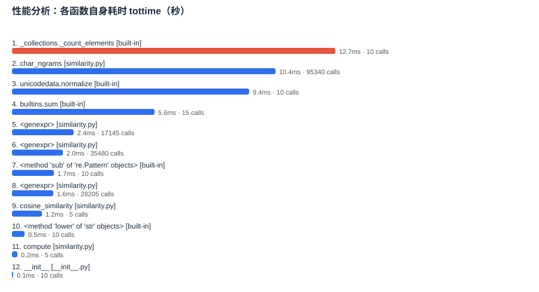

# 第一次个人编程作业：论文查重

> GitHub 仓库链接：https://github.com/LoVseele/LoVseele/tree/main/3124004443

| 这个作业属于哪个课程 | [软件工程](https://edu.cnblogs.com/campus/gdgy/Class78-Grade2024-CS/) |
| :--- | :--- |
| 这个作业要求在哪里 | [作业要求链接](https://edu.cnblogs.com/campus/gdgy/Class78-Grade2024-CS/homework/15702) |
| 这个作业的目标 | 实现一个论文查重算法 |

---

## 一、PSP 表格

| PSP2.1 | 阶段 | 预估（分钟） | 实际（分钟） |
| --- | --- | --- | --- |
| Planning | 估计任务量 | 10 | 10 |
| Analysis | 需求分析 | 25 | 30 |
| Design Spec | 生成设计文档 | 10 | 8 |
| Design Review | 设计复审 | 5 | 5 |
| Coding Standard | 代码规范 | 5 | 5 |
| Design | 具体设计 | 15 | 12 |
| Coding | 具体编码 | 45 | 55 |
| Code Review | 代码复审 | 15 | 12 |
| Test | 测试 | 30 | 38 |
| Test Report | 测试报告 | 10 | 8 |
| Size Measurement | 计算工作量 | 5 | 5 |
| Postmortem | 事后总结与改进 | 10 | 12 |
|  | **合计** | **185** | **200** |

实际用时超出预估，主要花在调试性能图与补齐异常分支的测试用例上。

---

## 二、模块设计与实现

### 1. 代码组织

```
main.py
  └─ main(argv)                              # 入口：解析 3 个路径 → 计算 → 写答案
        ├─ text_utils.read_text_file(path)    # 多编码容错读取
        └─ similarity.TextSimilarity.compute(original, plagiarized)
              ├─ text_utils.normalize(text)      # NFKC + 小写 + 去空白
              ├─ similarity.char_ngrams(text)    # 惰性切分字符 n-gram（默认 n=2）
              ├─ similarity.build_vector(tokens) # 统计为词频向量
              └─ similarity.cosine_similarity(a, b) → _cosine(...)  # 交集余弦
```

- `text_utils.py`：只负责把文件变成干净的字符串。`normalize()` 做归一化，`read_text_file()` 按 `utf-8 → utf-8-sig → gbk → gb18030` 依次尝试解码。
- `similarity.py`：算法层。`char_ngrams / build_vector / _cosine / cosine_similarity` 均为纯函数；`TextSimilarity` 是对外统一接口，通过 `method` 在 `cosine` 与 `simhash` 间切换；`naive_cosine_similarity` 仅用于性能对照。
- `main.py`：只做参数解析、文件 IO 与调用算法，不含算法细节。

### 2. 关键函数流程图



### 3. 算法要点

1. **字符 n-gram 而非分词**：中文无天然空格，分词需引入 jieba 等依赖，与"不联网、轻量"冲突；字符 n-gram 无需词典即可刻画局部结构，对增删改均稳健。
2. **余弦相似度**：重复率 = 余弦 × 100%。余弦对文本长度不敏感，值天然落在 [0,1]。
3. **只在公共键上求点积**：两向量维度很高但重合很少，先取 `vec_a.keys() & vec_b.keys()` 再累加，复杂度由 O(|A|·|B|) 降到 O(min(|A|,|B|))。
4. **n-gram 惰性产出**：用生成器逐个产出，避免长文本一次性分配完整列表，降低峰值内存。

### 4. 特点

- 零第三方运行时依赖，仅用标准库，直接满足评测约束。
- 双算法可切换：`cosine`（默认，精度好）+ `simhash`（O(n)，适合超长文档）。
- 读取鲁棒：多编码依次尝试，最后忽略无法解码的字节，保证有内容可比。
- 全局异常兜底：任何意外都写出 `0.00`，不会异常退出。

---

## 三、性能改进

用 cProfile 对查重流程做剖析，并针对最耗时处优化。

**改进点**：把双重循环余弦换成交集余弦。两者结果完全一致（单测 `test_naive_equals_efficient` 验证），但后者在公共键较少时快得多。微基准（高熵文本，各测 30 次）：

| 文本规模 | 交集余弦（ms/次） | 朴素双循环（ms/次） | 提速 |
| --- | --- | --- | --- |
| 300 字符 | 0.0256 | 2.0456 | 80× |
| 600 字符 | 0.0484 | 8.4067 | 174× |

规模翻倍时，朴素版耗时涨约 **4.1 倍**（≈ O(n²)），交集版涨约 **1.9 倍**（≈ O(n)）；规模越大，两者差距拉开得越明显。

**真实文本耗时**：`sample/orig.txt`（10511 字）对比 `sample/orig_0.8_dis_15.txt`（10512 字），5 次平均「读取文件 + 查重」为 **6.9 ms**，远低于 5 s 上限。

**消耗最大的函数**（按 `tottime`，5 次采样合计）：`_collections._count_elements`（12.7 ms，统计词频）> `char_ngrams`（10.4 ms，切 2-gram）> `unicodedata.normalize`（9.4 ms，NFKC 归一化）> `builtins.sum`（5.6 ms）。而求相似度的 `cosine_similarity` 仅 1.2 ms——瓶颈全在预处理，并且都是 O(n)。

**性能分析图**：


---

## 四、单元测试

共 **29 个** pytest 用例（`test_similarity.py`），源码语句与分支覆盖率均为 **100%**：

```
Name            Stmts  Miss Branch BrPart  Cover
main.py            24     0      2      0   100%
similarity.py      59     0     18      0   100%
text_utils.py      18     0      4      0   100%
TOTAL             101     0     24      0   100%
29 passed
```

> **【需手动截图】** 运行 `python -m pytest -q --cov=. --cov-branch --cov-report=term-missing`，将终端输出的覆盖率表截图贴到此处。

**测试设计**：等价类（相同/无关文本、子串抄袭、单字增删）、边界值（空文本、纯空白差异、全角半角、语序颠倒、n 取 1/2/3）、算法单元（对已知向量断言精确数值）、一致性（`naive` 与 `cosine` 结果必须一致）、异常与 CLI（缺文件、输出目录不存在均不崩溃）。

**代表性用例**：

```python
def test_cosine_known_vectors():
    va = build_vector(["a", "a", "b"])
    vb = build_vector(["a", "b"])
    expected = 3 / (5 ** 0.5 * 2 ** 0.5)
    assert abs(cosine_similarity(va, vb) - expected) < 1e-9
    assert cosine_similarity(va, build_vector([])) == 0.0

def test_read_text_file_fallback_ignores_bad_bytes():
    with tempfile.TemporaryDirectory() as tmp:
        path = os.path.join(tmp, "broken.txt")
        with open(path, "wb") as f:
            f.write(b"\xff\x81abc")                 # 四种编码均无法解码
        assert read_text_file(path) == "abc"        # 兜底忽略坏字节而非崩溃
```

> 说明：`.coveragerc` 排除开发脚本与测试文件本身；入口守卫 `if __name__ == "__main__":` 按惯例不计入覆盖率。

---

## 五、异常处理

| 异常场景 | 处理方式 | 对应测试 |
| --- | --- | --- |
| 参数不是 3 个 | 打印用法并 `return 1` | `test_main_bad_argc` / `test_main_wrong_arg_count_too_many` |
| 输入文件不存在 | IO 错误交由 `main` 兜底写出 `0.00` | `test_main_missing_file_no_crash` |
| 文件编码异常 | 多编码依次尝试，最后忽略坏字节 | `test_read_text_file_fallback_ignores_bad_bytes` |
| 文本为 `None` | `normalize` 返回空串 | `test_normalize_none_returns_empty` |
| 空原文 / 空抄袭版 | 向量为空时 `_cosine` 返回 `0.0`，避免除零 | `test_empty_original` / `test_empty_plagiarism` |
| 答案文件写不出 | 内外两层 `try/except` 兜底，仍正常返回 | `test_main_unwritable_answer_path_no_crash` |

**示例（缺失文件不崩溃）**：

```python
def test_main_missing_file_no_crash():
    with tempfile.TemporaryDirectory() as tmp:
        op = os.path.join(tmp, "nonexistent.txt")
        pp = os.path.join(tmp, "plag.txt")
        ap = os.path.join(tmp, "ans.txt")
        with open(pp, "w", encoding="utf-8") as f:
            f.write("hello")
        assert main([op, pp, ap]) == 0              # 缺失文件也不异常退出
        with open(ap, "r", encoding="utf-8") as f:
            assert f.read().strip() == "0.00"       # 兜底写出 0.00
```

---

## 六、运行与复现

核心程序仅依赖标准库，可直接运行：

```bash
# 用法：python main.py <原文> <抄袭版> <答案文件>
python main.py "sample/orig.txt" "sample/orig_0.8_dis_15.txt" "sample/ans.txt"
```

在 `sample/` 测试集上的运行结果（答案文件为 `sample/ans_*.txt`）：

| 抄袭版 | 重复率 |
| --- | --- |
| orig_0.8_add.txt | 94.17% |
| orig_0.8_del.txt | 94.12% |
| orig_0.8_dis_1.txt | 98.43% |
| orig_0.8_dis_10.txt | 94.06% |
| orig_0.8_dis_15.txt | 82.91% |

`dis` 后的数字表示字符被打乱的程度，数字越大重复率越低，与预期一致。

测试与质量分析需先激活项目虚拟环境 `.venv`（其中已安装 pytest、pytest-cov、pylint）：

```bash
# 激活虚拟环境（Windows）
.venv\Scripts\activate

# 单元测试 + 分支覆盖率
python -m pytest -q --cov=. --cov-branch --cov-report=term-missing

# 代码质量（10.00/10，无警告）
python -m pylint text_utils.py similarity.py main.py

# 性能剖析与画图
python profile_run.py && python make_chart.py
```

---

## 附：需要手动截图的位置

| 位置 | 截图内容 | 生成命令 |
| --- | --- | --- |
| 第三节「性能分析图」 | `profile_chart.svg` 渲染效果 | `python profile_run.py && python make_chart.py` |
| 第四节「覆盖率」 | 终端覆盖率表 | `python -m pytest -q --cov=. --cov-branch --cov-report=term-missing` |
| 第六节（可选） | pylint 评分 `10.00/10` | `python -m pylint text_utils.py similarity.py main.py` |

> 上表中第 2、3 条需在已激活的项目虚拟环境（`.venv`）中执行；核心程序本身无需虚拟环境。
