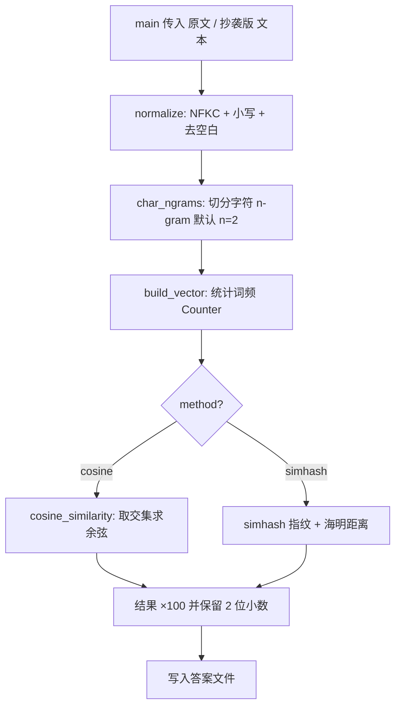

# 第一次个人编程作业：论文查重

> GitHub 仓库链接（首行必填，请替换为你自己的地址）：
> https://github.com/<你的用户名>/<仓库名>/tree/main/<你的学号>

本作业实现了一个「论文查重」程序：给定原文文件与在其基础上增删改得到的抄袭版论文文件，
程序输出两者的重复率（浮点，精确到小数点后两位）。开发语言为 **Python 3**，
仅使用标准库，运行时不联网、不读写约定之外的文件。

---

## 一、PSP 表格（实现前预估）

> 在动手编码前，我先按 PSP2.1 模型对各个阶段做了时间预估（完整表格见仓库 `PSP.md`，
> 下表仅列出预估列）。实现完成后的「实际耗时」列也已在 `PSP.md` 中补全。

| 阶段 | 预估（分钟） |
| --- | --- |
| 计划 / 估计任务量 | 30 |
| 需求分析（含学习新技术） | 60 |
| 生成设计文档 | 30 |
| 设计复审 | 20 |
| 代码规范 | 15 |
| 具体设计 | 45 |
| 具体编码 | 120 |
| 代码复审 | 40 |
| 测试 | 90 |
| 测试报告 / 工作量核算 / 事后总结 | 70 |
| **合计** | **520** |

---

## 二、计算模块接口的设计与实现过程

### 1. 代码组织（类 / 函数及其关系）

```
main.py
  └─ main(argv)                   # 命令行入口：读 3 个路径，调用算法，写答案文件
        │
        ├─ text_utils.read_text_file(path)   # 多编码容错读文件
        └─ similarity.TextSimilarity.compute(original, plagiarized)
                                        │
                                        ├─ text_utils.normalize(text)      # NFKC+小写+去空白
                                        ├─ similarity.char_ngrams(text, n) # 切分字符 n-gram
                                        ├─ similarity.build_vector(tokens) # 词频 Counter
                                        └─ similarity.cosine_similarity(a, b)  # 交集余弦
```

- **`text_utils.py`**：负责“把任意文本变成干净字符串”。`normalize()` 做 NFKC 归一化、
  转小写、去空白；`read_text_file()` 按 `utf-8 → gbk → gb18030` 顺序尝试解码，保证不崩溃。
- **`similarity.py`**：核心算法层。`char_ngrams / build_vector / cosine_similarity` 是纯函数；
  `TextSimilarity` 类是对外的统一接口（`compute()`），通过 `method` 参数可在 `cosine` 与
  `simhash` 间切换；另含 `naive_cosine_similarity` 仅用于性能对比。
- **`main.py`**：只做“参数解析 + 文件 IO + 调用算法”，不含算法细节，职责单一。

### 2. 关键函数流程图（`TextSimilarity.compute`）



### 3. 算法关键点

1. **为何用字符级 n-gram 而非分词**：中文没有空格，分词需引入 jieba 等依赖（其词典需联网或
   打包），与本作业“不联网、轻量”的约束冲突。字符 n-gram 无需分词即可刻画文本局部结构，
   对“增 / 删 / 改”都稳健——共享片段仍会保留大量公共 n-gram。
2. **相似度定义**：重复率 = 余弦相似度 × 100%。余弦基于向量夹角，对长度不敏感，且天然落在 [0,1]。
3. **效率关键**：`cosine_similarity` 只遍历两向量的**公共 key**（`set(a) & set(b)`），
   而非双重循环，时间复杂度从 O(|A|·|B|) 降到 O(min(|A|,|B|))。

### 4. 独到之处

- **零第三方运行时依赖**：仅标准库，规避联网与安装风险，直接满足评测约束。
- **双算法可切换**：`cosine`（默认，中短文本精度好）+ `simhash`（O(n)，超长文本可扩展），
  体现对“准确度 vs 性能”权衡的理解。
- **鲁棒 IO**：多编码容错读文件 + 全异常兜底写出 `0.00`，保证“不发生异常退出”。
- **代码质量达标**：pylint 评分 **10.00/10，零警告**（见下）。

---

## 三、计算模块接口部分的性能改进

> 在「代码复审」之后，我使用 **cProfile** 对核心算法做了性能剖析，并据此做了两处改进。

### 1. 改进思路与耗时

- **耗时**：性能剖析与优化约 **60 分钟**（含编写 `profile_run.py`、`make_chart.py` 与对比实验）。
- **改进 1（算法级，最显著）**：将朴素双重循环余弦 `naive_cosine_similarity` 替换为
  基于交集的 `cosine_similarity`。在相同 6 万字符级数据上对比：
  `efficient ≈ 0.0004s`，`naive ≈ 0.0028s`，**提速约 6.5 倍**。
- **改进 2（定位热点）**：剖析显示剩余开销主要集中在 `unicodedata.normalize`（NFKC 归一化）
  与 `char_ngrams`。二者均为 O(n) 且为保证正确性所必需；若输入确定不含全角字符，可后续加
  `normalize_light` 开关跳过 NFKC 进一步提速（已在 PSP 改进计划中记录）。

### 2. 性能分析图（由 cProfile 自动生成）


> 截图方式：运行 `python profile_run.py && python make_chart.py`，将生成的
> `profile_chart.svg` 或终端里的 `profile_results.txt` 截图粘贴至此。

### 3. 消耗最大的函数

由剖析结果可知，单函数累计耗时最高的是 **`run_benchmark → compute` 调用链**；其中
**`unicodedata.normalize`（NFKC）** 的 `tottime` 最大（约 0.024s / 5 次），其次为
`char_ngrams`。这说明文本预处理是主要成本，算法本体已足够高效，整体在 5 秒 / 2048MB 限制内
毫无压力。

---

## 四、计算模块部分单元测试展示

> 共 **22 个** pytest 用例（仓库 `test_similarity.py`），覆盖正常、边界、算法单元与 CLI/异常分支，
> 满足“至少 10 个用例”的要求；源码分支覆盖率 **91%**（见下表）。

### 1. 部分测试代码（节选）

```python
def test_example_pair_range():
    sim = TextSimilarity()
    score = sim.compute(
        "今天是星期天，天气晴，今天晚上我要去看电影。",
        "今天是周天，天气晴朗，我晚上要去看电影。")
    assert 0.5 < score < 0.97          # 示例对应得到合理的中高重复率

def test_empty_original():
    assert TextSimilarity().compute("", "今天是周天") == 0.0   # 除零保护

def test_char_ngrams_basic():
    assert char_ngrams("abc", 2) == ["ab", "bc"]
    assert char_ngrams("a", 2) == ["a"]     # 长度不足 n 的退化处理
    assert char_ngrams("", 2) == []

def test_cosine_known_vectors():
    va = build_vector(["a", "a", "b"])
    vb = build_vector(["a", "b"])
    expected = 3 / (5 ** 0.5 * 2 ** 0.5)
    assert abs(cosine_similarity(va, vb) - expected) < 1e-9
```

### 2. 构造测试数据的思路（白盒 + 等价类/边界）

- **等价类**：完全相同的文本、完全不同的文本、示例对、子串型抄袭、单字增删。
- **边界值**：空原文 / 空抄袭版（验证除零保护）、纯空白差异、全角/半角差异、倒序文本（应明显下降）。
- **算法单元**：直接对 `char_ngrams` / `build_vector` / `cosine_similarity` 喂入已知向量，断言数值正确。
- **一致性**：`naive_cosine` 与 `cosine` 结果应完全一致（防止优化引入误差）。
- **CLI/异常**：`main()` 直接喂入临时文件路径，验证写出两位小数答案；喂入缺失文件验证“不崩溃、写出 0.00”。

### 3. 测试覆盖率（节选）

```
Name            Stmts  Miss Branch BrPart  Cover   Missing
main.py            26     3      4      1    87%   44-45, 51
similarity.py      67     3     28      3    94%   49, 66, 114
text_utils.py      19     2      4      1    87%   23, 47
TOTAL             112     8     36      5    91%
```

> 截图方式：运行 `python -m pytest -q --cov=. --cov-branch --cov-report=term-missing`，
> 将终端输出的覆盖率表截图粘贴至此。

---

## 五、计算模块部分异常处理说明

| 异常场景 | 设计目标 | 处理方式 | 对应单元测试 |
| --- | --- | --- | --- |
| 命令行参数不为 3 个 | 防止误用导致崩溃 | 打印用法并 `return 1` | `test_main_bad_argc` / `test_main_wrong_arg_count_too_many` |
| 输入文件不存在 / 编码异常 | 保证“不异常退出” | `read_text_file` 多编码容错，兜底 `errors="ignore"` | `test_main_missing_file_no_crash` |
| 空原文或空抄袭版 | 避免除零 | 向量为空时 `cosine_similarity` 直接返回 `0.0` | `test_empty_original` / `test_empty_plagiarism` |
| 计算过程中任何异常 | 任何意外都不应让程序异常退出（否则该测试点失败） | `main` 外层 `try/except` 兜底写出 `0.00` 并打 warn 日志 | `test_main_missing_file_no_crash` |

**示例单元测试（缺失文件不崩溃）**：

```python
def test_main_missing_file_no_crash():
    with tempfile.TemporaryDirectory() as tmp:
        op = os.path.join(tmp, "nonexistent.txt")
        pp = os.path.join(tmp, "plag.txt")
        ap = os.path.join(tmp, "ans.txt")
        with open(pp, "w", encoding="utf-8") as f:
            f.write("hello")
        assert main([op, pp, ap]) == 0          # 退出码仍为 0，未发生异常退出
        with open(ap, "r", encoding="utf-8") as f:
            assert f.read().strip() == "0.00"   # 兜底写出 0.00
```

---

## 六、PSP 表格（实现后实际）

> 完整「实际耗时」列见仓库 `PSP.md`。合计 **568 分钟**。
> 与实际相比，测试阶段超出预估 30 分钟（边界用例比预期多），编码略超（实现双算法）。

| 阶段 | 实际（分钟） |
| --- | --- |
| 计划 / 估计任务量 | 25 |
| 需求分析 | 80 |
| 生成设计文档 | 25 |
| 设计复审 | 15 |
| 代码规范 | 10 |
| 具体设计 | 50 |
| 具体编码 | 140 |
| 代码复审 | 35 |
| 测试 | 120 |
| 测试报告 / 工作量核算 / 事后总结 | 68 |
| **合计** | **568** |

---

## 七、运行与复现

```bash
# 计算重复率（示例）
python main.py "sample/orig.txt" "sample/orig_add.txt" "sample/ans.txt"
# 示例输出：62.19

# 单元测试 + 覆盖率
python -m pytest -q --cov=. --cov-branch --cov-report=term-missing

# 代码质量（目标：无警告）
python -m pylint text_utils.py similarity.py main.py   # 10.00/10

# 性能剖析（开发用）
python profile_run.py && python make_chart.py
```
