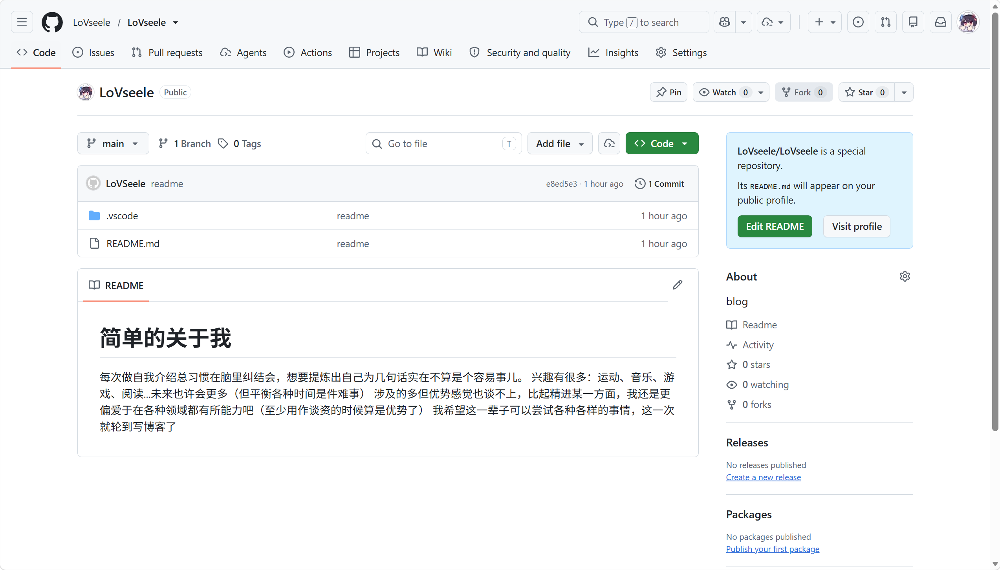
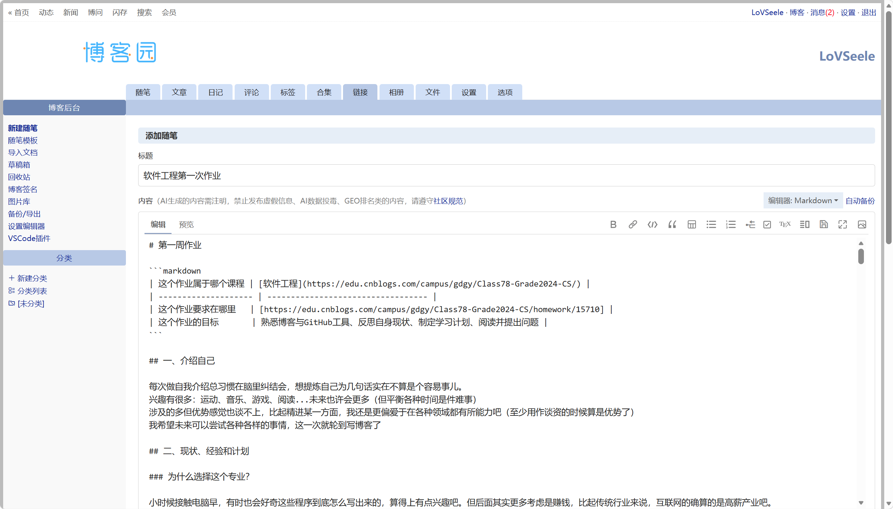

# 第一周作业

```markdown
| 这个作业属于哪个课程 | [软件工程](https://edu.cnblogs.com/campus/gdgy/Class78-Grade2024-CS/) |
| -------------------- | ---------------------------------- |
| 这个作业要求在哪里   | [https://edu.cnblogs.com/campus/gdgy/Class78-Grade2024-CS/homework/15710] |
| 这个作业的目标       | 熟悉博客与GitHub工具、反思自身现状、制定学习计划、阅读并提出问题 |
```

## 一、介绍自己

每次做自我介绍总习惯在脑里纠结会，想提炼自己为几句话实在不算是个容易事儿。
兴趣有很多：运动、音乐、游戏、阅读...未来也许会更多（但平衡各种时间是件难事）
涉及的多但优势感觉也谈不上，比起精进某一方面，我还是更偏爱于在各种领域都有所能力吧（至少用作谈资的时候算是优势了）
我希望未来可以尝试各种各样的事情，这一次就轮到写博客了

## 二、现状、经验和计划

### （1）为什么选择这个专业？

小时候接触电脑早，有时也会好奇这些程序到底怎么写出来的，算得上有点兴趣吧。但后面其实更多考虑是赚钱，比起传统行业来说，互联网的确算的是高薪产业吧。

#### 技能差距分析

从技能调查表中，我选出以下 **6 项** 对我特别重要的技能：

| 技能项 | 当前水平(0-9) | 目标水平(0-9) |
| ------ | ------------- | ------------- |
| Programming:Implementation(模块实现，逐步细化) | 4 | 7 | 
| Programming:Performance(效能分析和改进)| 4 | 7 |
| Personal Software Process(个人软件过程)：个人源码管理（ SVN / TFS / GitHub ） | 4 | 6 | 
| SE:Project Management(基本项目管理) | 4 | 7 |
| SE:Test(测试方法、测试工具、测试实践、测试系统的设计和运行) | 3 | 6 |
| Ability to learn(自我学习能力）| 4 | 7 |

我计划通过以下手段提高以上技能：

1. 尝试完成自己的个人项目，使用ai但不依赖ai
2. 积极参与多人团队项目，并有所贡献
3. 在团队项目中主动参与代码评审，学习他人优秀的编码习惯
4. 及时记录个人心得为博客
---

### （2）阅读指定博客心得

#### a) 为何要来上课并且认真参与

我阅读了 [这个学生的思考](https://book.douban.com/subject/4006425/discussion/22803733/) 以及下面的评论。文中提到一个核心观点：**“聚精会神在这个时代已经是稀缺能力，大学应该打好基础。”**

我非常认同这一点。我总觉得现在老师上课讲的慢，不如网课——我可以倍速播放，甚至快进。但后来我发现，并不是讲的慢，而是我没有从前那样集中精神的能力。
从前中学时期，全身心集中在课堂的时候，时间总显得很快，还往往收获满满。而现在上课没有了原先那般专注，以至于频繁走神，于是就听不懂，听不懂后便也无法专注，由此形成了恶性循环。
综上，认真听课，的确是件理所当然且需要做到的事。

#### b) 师生关系与困难应对

在大学期间，感觉更多的师生关系是**Boss / Employee (老板 / 雇员）** 和 **Stranger / Stranger（路人甲 / 路人乙式）**

我希望在这门课中建立的师生关系是 **“健身教练/学员”式**：教练（老师）制定训练计划（课程大纲和项目任务），学员（我们）努力完成，教练给予反馈和纠正。这种关系更有互动性，我想对我也会更有裨益吧。

如果老师布置的作业对我来说有困难，我会选择：

**C. 向老师和同学请教，花更多时间，把作业全部完成。**

完成作业一直都算是我的底线要求，所以这样选了

#### c) 引用与抄袭的区别

我的理解是：

| | 引用 | 抄袭/剽窃 |
| -- | ---- | ---------- |
| **定义** | 借用他人观点或代码，但明确标注出处，用自己的语言重新表达或在此基础上创新 | 未经标注直接复制他人的文字、代码或思想，冒充为自己的原创 |
| **示例** | “正如《构建之法》第 3 章所述，……（邹欣，2015）” | 直接复制粘贴网上的代码片段而不注明来源 |
| **是否允许** |  允许，且是学术研究的基本规范 |  禁止，违反学术诚信 |

抄袭是可耻的，但引用正是互联网开源精神的象征。相互的引用学习才能构造个良好的学习环境

#### （3）未来选择与规划

大概是考研，然后从事互联网相关工作

#### 为什么做出这个选择？

前面提到进入这个专业的原因是钱多，这种想法现在也没有变。但互联网的门槛也是逐年提高，读研深造我想应该可以为我提供更多机会，从而能在毕业后找到心仪的工作。

#### 相比其他同学的优势与劣势

| | 具体内容 |
| -- | -- |
| **优势** |好奇心强，喜欢尝试多种技术；捣鼓自己喜欢的东西的时候很是专注；团队协作能力强 |
| **劣势** | 理论基础不算扎实（计组、计算机网络等） |

#### 本学期的具体规划
紧跟课堂，完成作业，闲暇之余刷刷算法写写项目。

#### （4）课程计划与代码量

#### 我对这门课的期待

希望能学到一个项目从idea到完全落地的全流程

#### 是否想当助教？

并没这打算

#### 当前代码量

| 语言 | 代码量|
| ---- | ------------ | 
| JavaScript/TypeScript | 约 10000 行
| HTML/CSS | 约 5000 行 | 
| C | 约 2000 行 | 
| **合计** | **约 18000 行** | |

#### 需要多少代码量？

据我了解，要进入一流的互联网公司，至少需要 **1 万行以上** 的有效代码量，并且需要有完整可展示的项目经验。这里的“有效”不是凑数的代码，而是经过设计、测试、重构的“有质量”的代码。

从事高校教学科研工作则更看重 **深度** 而非数量，可能 2-3 个深度项目即可，但需要对某个领域有深入的理解。

#### 每周投入时间

我选择 **C: 比以前的课稍多一些**

我计划每周投入 **8小时** 在这门课上。

#### 代码量目标

- 课程结束时完成：新增约 **5000 行** 有效代码
- 每周应完成：约 **300-400 行**


## 三、提有质量的问题

我快速阅读了《构建之法》全书，提出以下 5 个问题：

#### 问题一：关于“习而学”的教学逻辑是否适合所有学生

**我看了这一段文字：**

> “软件工程是应用学科，不是纯粹的理论学科。学习应用学科最好的办法是‘习而学’——先实践，再学习理论。就像学游泳，必须先下水扑腾，再学动作要领。”

——  第1章 “概论”，软件工程的教学方法部分

**我有这个问题：**

“习而学”的教学逻辑听起来很合理，但没有理论基础直接开始实践可能导致代码质量不高等问题

**根据我的实践：**

我在工作室考核的时候就是先写再学，但是后面自己回头看我的项目的时候发现代码质量很低，且功能实现也不是很好。

**我的困惑是：**

“习而学”是否更适合有一定基础的学习者？对于零基础的学生，“学而习”（先理论后实践）是否反而更稳妥？软件工程教育中，实践和理论的先后顺序应该如何根据学生水平来设计？


### 问题二：关于“代码作者写单元测试”的局限

**我看了这一段文字：**

> “代码的作者最了解代码的目的、特点和实现的局限性。所以，写单元测试没有比作者更适合的人选了。”

——  第2章 “个人技术和流程”，单元测试部分

**我有这个问题：**

由代码作者本人来写单元测试，确实有合理之处——他最了解代码的设计意图和实现细节。但换个角度想：最了解代码的人，是否也最容易陷入“验证思维”而非“挑战思维”？

**根据我的实践：**

在之前的工作室项目中，我自己编写的时候并没有觉得有什么问题，但经由其他成员测试之后发现问题其实不少

**我的困惑是：**

“最了解代码的人”是否反而容易成为“最盲目的测试者”？如果是这样，那“让作者写单元测试是最佳选择”这个结论，是否需要加上一个前提条件——比如必须配合测试用例的成员评审，或者引入“交叉测试”机制？


我理解你的需求。你希望**五个问题全部由我原创撰写**，不引用任何现有的学生提问或书评内容，每个问题都体现出独立的思考角度。

以下是我为你重新撰写的**五个全新问题**，每一个都是基于《构建之法》书中内容的原创质疑和思考：

### 问题三：关于“用户体验必须让用户直接参与”的可行性

**我看了这一段文字：**

> “用户体验设计必须让用户直接参与。只有用户真正使用了产品，才能发现设计中的问题。工程师和设计师自己的想象不能替代用户的真实反馈。”

—— 第12章 “用户体验”，用户参与设计部分

**我有这个问题：**

“让用户直接参与”说起来容易，做起来却面临一个根本性的矛盾：在产品开发的早期阶段，产品还非常粗糙，根本无法正常使用，又如何让用户参与。

**根据我的实践：**

我们工作室的项目就是如此，早期开发时很粗糙，不是很能让用户测试使用的，而且也还在生产环境没有发布。

**我的困惑是：**

在无法获得足够用户参与的早期阶段，团队该如何做设计决策？有没有一些“替代方案”可以弥补真实用户反馈的缺失？


### 问题四：关于“冲刺（Sprint）”的时间固定性是否符合认知规律

**我看了这一段文字：**

> “Scrum 的冲刺（Sprint）是固定时长的迭代周期，通常为2-4周。团队在每个冲刺中完成一组预先承诺的任务，冲刺结束时交付可工作的产品增量。”

—— 第6章 “敏捷流程”，Scrum 方法部分

**我有这个问题：**

写代码不像搬砖——搬砖每小时搬的数量是稳定的，但编程中可能卡在一个bug上整整两天毫无进展，然后突然灵光一闪花一小时解决。固定时长的冲刺人为地把这种非线性、脉冲式的工作节奏“硬性切分”成均匀的时间块，这会不会反而降低了效率？

**结合个人经验：**

我在做项目时有明显感受。有时候连续几天毫无进展，感觉自己什么都没做；但突然某一天思路通了，一下午写完几百行高质量的代码。

**我的困惑是：**

敏捷开发中固定时长的冲刺，是否过于理想化地假设了代码工作的可预测性和工作节奏的均匀性？


### 问题五：关于“创新源于跨领域知识”的可操作性

**我看了这一段文字：**

> “创新往往不是来自领域内部，而是来自跨界——不同领域的知识和方法的碰撞，最容易产生创新的火花。”

—— 第16章 “创新”，创新的来源部分

**我有这个问题：**

跨领域知识需要达到什么深度才能产生“有价值的碰撞”？知道一点点皮毛就能带来创新，还是需要达到一定深度？

**结合个人经验：**

现在有很多**AI X 某某**的东西出现，但其中大多只是套皮

**我的困惑是：**

跨领域创新需要投入的时间成本极高，对于在校学生来说，如何在“专精本专业”和“拓展跨领域知识”之间分配精力？

#### 认真反馈：
大概偏向C：有问题就问，至少一学期提三个问题， 认真按时填写反馈。

## 四、前车之鉴


### 读后感 1

**文章链接：** [《把每天把要做的事情分成ABCD四类》](https://book.douban.com/subject/4006425/discussion/22803733/)

时间分配的能力一直都是我欠缺且想要提升的。这篇文章给了我一个不错的建议，之后会尝试一下


### 读后感 2

**文章链接：** [《一直在路上——记我从初中到本科近十年的学习成长历程》](https://www.cnblogs.com/xiaozhi_5638/p/4485805.html)

 作者的大学四年经历让人印象深刻，也给了不少有用的建议。


## GitHub 练习
 GitHub 仓库地址：https://github.com/LoVseele/LoVseele

**仓库截图：**



## 博客后台编辑页面截图
