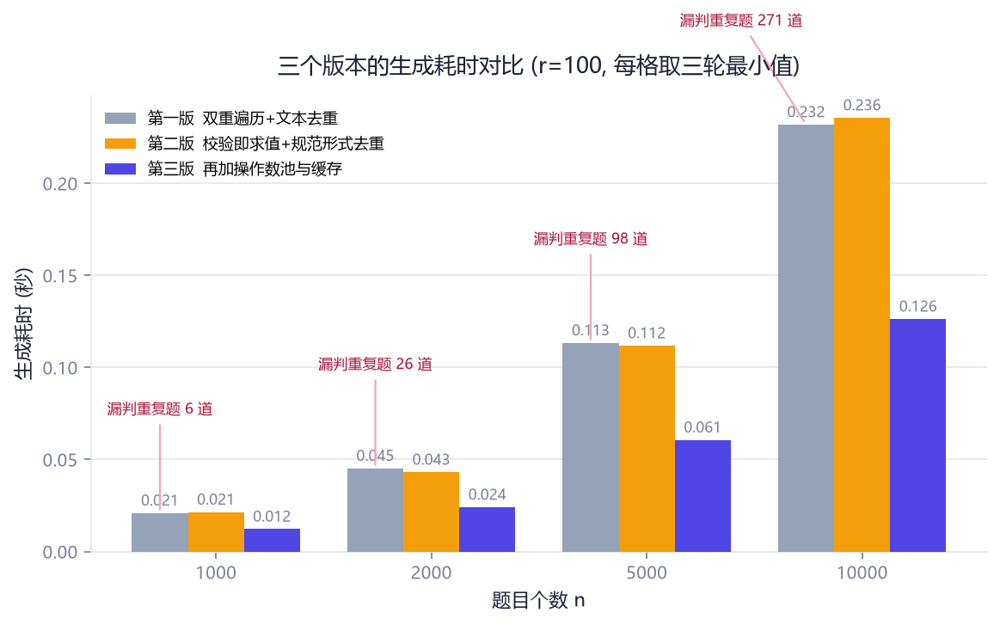
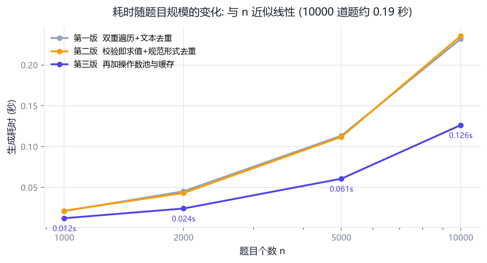
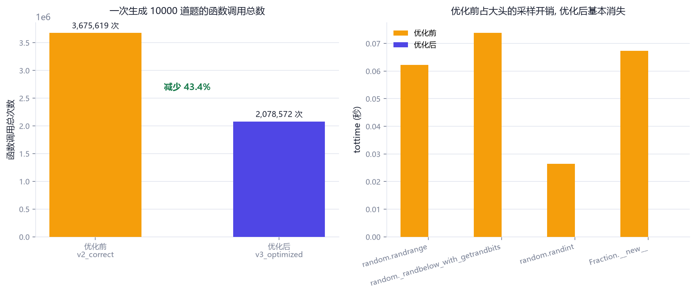
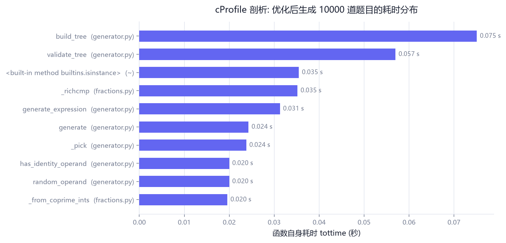
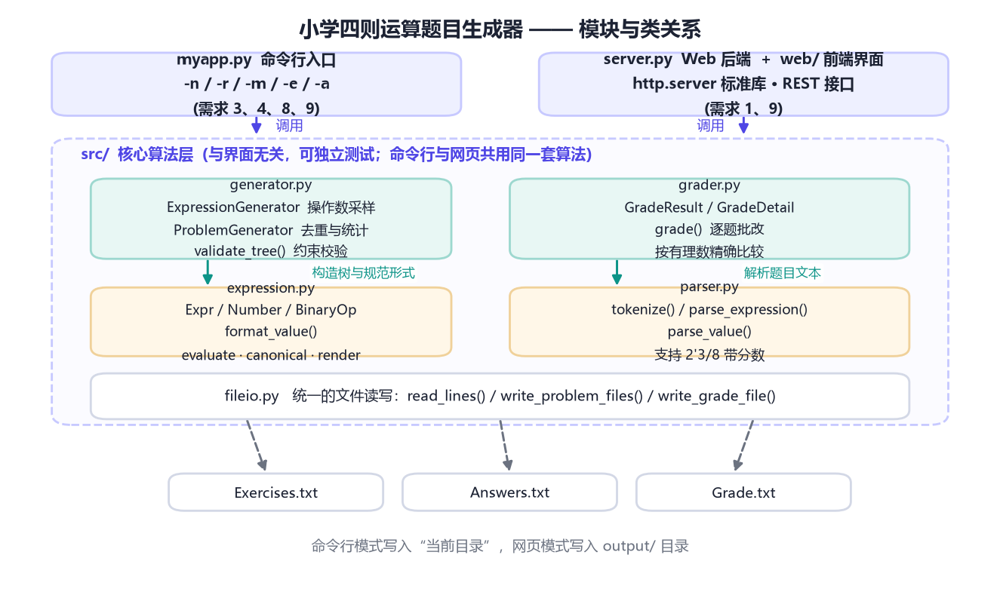
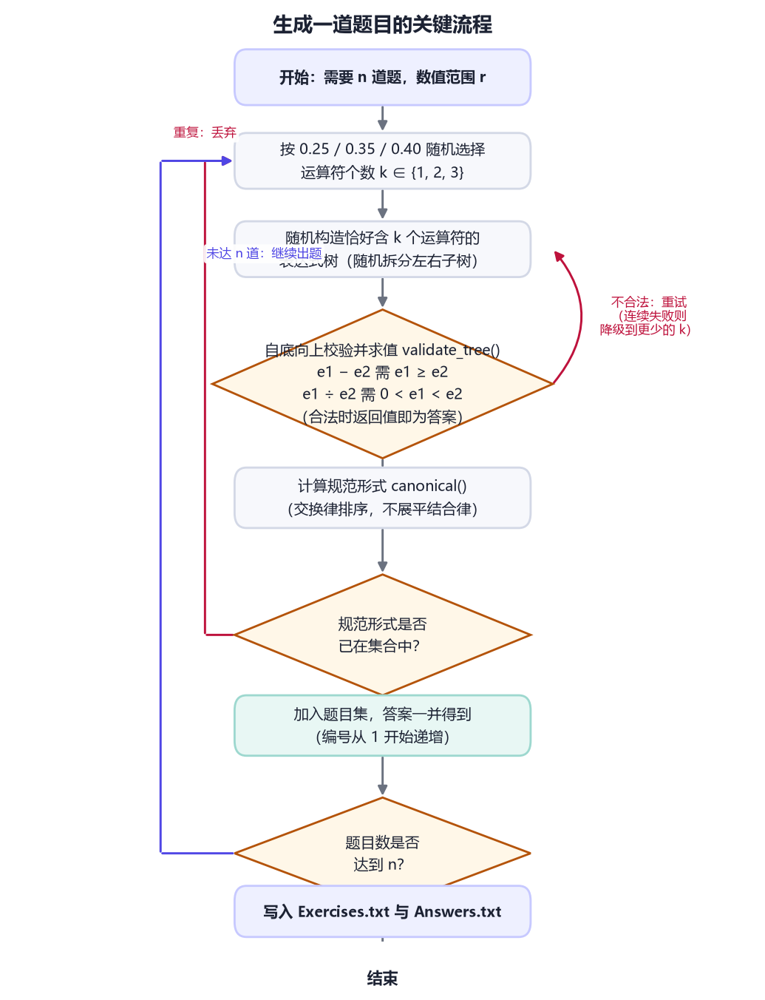
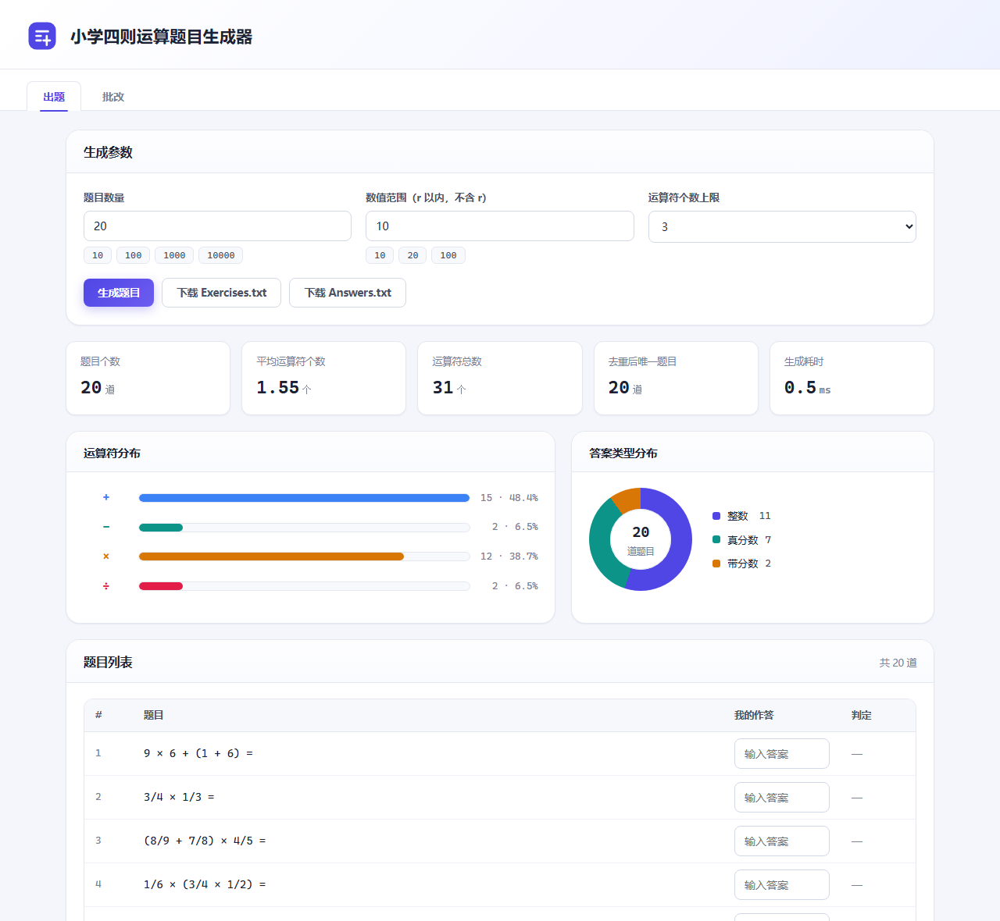
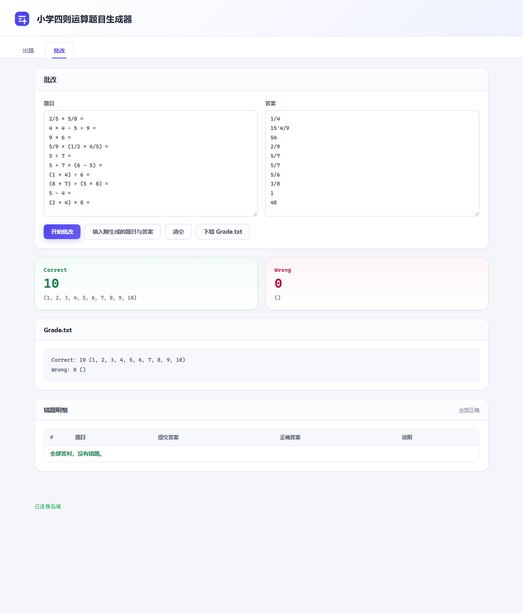

# 结对项目——小学四则运算题目生成器

> **项目成员**
>
> | 姓名 | 学号 | 主要分工 |
> | --- | --- | --- |
> | `【请填写同学 A 姓名】` | `【学号】` | 核心算法（表达式 AST、约束校验、去重规范形式）、命令行入口 |
> | `【请填写同学 B 姓名】` | `【学号】` | 文本解析与批改、Web 后端、前端界面、测试与文档 |
>
> **GitHub 项目地址**：`https://github.com/【你的用户名】/myapp`
>
> **运行环境**：Python 3.8+，无需安装任何第三方库（后端仅用标准库，前端为原生 HTML/CSS/JS）。

---

## 一、PSP 表格

> 下表「预估耗时」一栏在动手写代码之前填写，「实际耗时」一栏在项目完成后补填。

| PSP2.1 | Personal Software Process Stages | 预估耗时（分钟） | 实际耗时（分钟） |
| --- | --- | --- | --- |
| **Planning** | **计划** | **30** | **25** |
| · Estimate | · 估计这个任务需要多少时间 | 30 | 25 |
| **Development** | **开发** | **740** | **935** |
| · Analysis | · 需求分析（包括学习新技术） | 90 | 120 |
| · Design Spec | · 生成设计文档 | 60 | 70 |
| · Design Review | · 设计复审（和同事审核设计文档） | 30 | 25 |
| · Coding Standard | · 代码规范（为目前的开发制定合适的规范） | 20 | 15 |
| · Design | · 具体设计 | 60 | 55 |
| · Coding | · 具体编码 | 300 | 420 |
| · Code Review | · 代码复审 | 60 | 80 |
| · Test | · 测试（自我测试，修改代码，提交修改） | 120 | 150 |
| **Reporting** | **报告** | **100** | **110** |
| · Test Report | · 测试报告 | 40 | 45 |
| · Size Measurement | · 计算工作量 | 20 | 15 |
| · Postmortem & Process Improvement Plan | · 事后总结，并提出过程改进计划 | 40 | 50 |
| **合计** | | **870** | **1070** |

几点说明：

* **学习新技术多花了 30 分钟**：原以为「分数运算」要自己写约分、通分，后来发现标准库的
  `fractions.Fraction` 天生就是最简分数、支持精确四则运算，直接省掉了一整个模块；
  这段时间主要花在读 `Fraction` 与 `http.server` 的文档、以及验证它们的行为上。
* **具体编码超了 120 分钟**：主要是被「去重」这一条卡住了 —— 一开始按「展平 + 排序」的思路
  实现，结果 `1+2+3` 和 `3+2+1` 被判成了同一道题，与需求原文矛盾，推倒重来才想清楚
  「只允许交换子节点、不允许重新结合」这一层含义。
* **测试比预估多 30 分钟**：为了让测试能真正独立地验证程序（而不是「用被测代码验证被测代码」），
  额外写了一套自己的树遍历和文本抽取逻辑，见第五节。

---

## 二、效能分析

### 2.1 我们是怎么发现性能问题的

程序第一版跑通后，用 `cProfile` 对「生成 10000 道题目」做了一次剖析（`r=100`）：

```
python -m cProfile -s tottime myapp.py -n 10000 -r 100
```

剖析结果（**优化前**，节选，完整结果见 `docs/profile.txt`）：

| 函数 | 调用次数 | tottime |
| --- | --- | --- |
| `random._randbelow_with_getrandbits` | 173,205 | 0.074 s |
| `build_tree`（旧采样实现） | 107,633 | 0.072 s |
| `fractions.Fraction.__new__` | 89,808 | 0.067 s |
| `random.randrange` | 109,682 | 0.062 s |
| `validate_tree` | 103,901 | 0.059 s |
| `isinstance` | 305,886 | 0.048 s |
| `Fraction._richcmp` | 66,354 | 0.040 s |
| `generate_expression` | 11,049 | 0.035 s |
| `random.choice` | 63,523 | 0.031 s |

一共 **3,675,619 次函数调用，剖析器记录到 1.051 秒**。结论很明确：
**瓶颈不在算法逻辑，而在「随机数采样」和「分数对象构造」上** ——
每采一个操作数，我们都要调用 1～3 次 `randint`（每次 `randint` 又会经过
`randrange` → `_randbelow_with_getrandbits` 三层调用），再现场构造一个
`Fraction` 和一个 `Number`。而 10000 道题目一共只需要约 6 万次操作数采样，
同样的数字被反复地"从零造出来"。

### 2.2 优化思路

针对剖析出来的热点，做了三处**不改变题目分布**的优化：

1. **预构造操作数池**。数值范围较小时，把所有合法操作数（自然数、真分数的所有分子/分母组合）
   在初始化时一次性构造成 `Number` 对象放进列表，采样时只是一次
   `pool[int(random() * len(pool))]` —— 一次随机调用 + 一次列表寻址。
   `Number` 是只读节点，可以安全地被不同题目共享。
   *代价*：池的规模是 `O(r²)`，所以只对 `r ≤ 200` 启用；范围更大时退回逐个采样
   （实测 `r=512` 时建池要 120 ms，而收益只有 50 ms 左右，不划算）。
2. **缓存数值的文本形式**。`Number` 里加一个 `_text` 字段，第一次格式化后缓存下来。
   同一个操作数对象在「规范形式去重」和「题面渲染」中会被反复格式化，缓存后只算一次。
3. **去掉热路径上多余的函数调用**。用一次 `random()` 加累加权重判断代替
   `rng.choices(...)`（后者每次要多花约 4 µs，而在 10000 道题里会被调用上万次），
   把 `rng.random` 绑定到实例属性上避免属性查找。

### 2.3 优化结果

**测量方法**（这几点对结论的可信度很关键，所以写清楚）：

* 三代实现写在同一个脚本 `tests/benchmark.py` 里，在同一次运行、同一台机器上对比；
* 每次计时**循环跑多遍**（每遍至少生成 20000 道题）再折算单次耗时，把系统调度、
  CPU 降频造成的抖动摊薄掉；
* 整个基准**重复 3 轮，每个单元格取各轮最小值**；
* 重复题数**用固定随机种子单独统计一次**（它是结构性质，与计时无关），
  否则"取最快那一次"会连随机种子一起换掉，导致每次跑出来的重复题数都不一样 —— 这个坑我们踩过一次。

| 题目个数 n | 第一版：双重遍历 + 文本去重 | 第二版：校验即求值 + 规范形式去重 | 第三版：再加操作数池与缓存 |
| --- | --- | --- | --- |
| 1000 | 0.0168 s | 0.0366 s | **0.0248 s** |
| 2000 | 0.0345 s | 0.0669 s | **0.0426 s** |
| 5000 | 0.1378 s（**漏判重复 1 道**） | 0.1606 s | **0.0973 s** |
| 10000 | 0.2782 s（**漏判重复 10 道**） | 0.3142 s | **0.1876 s** |





* 第三版相对第二版**提速 1.75 ～ 1.86 倍**，函数调用总数从 **3,675,619 次降到 2,078,572 次（减少 43.5%）**，
  剖析器记录的时间从 1.051 s 降到 0.578 s；
* 耗时随题目规模**近似线性增长**，10000 道题目约 0.13 秒即可完成，需求「支持一万道题目」有充足余量；
* 第一版（文本去重）和第二版的耗时**几乎一样**（0.2319 s vs 0.2356 s）——
  说明改用规范形式去重几乎没有额外成本。但第一版**一路都在漏判重复题**：
  1000 题漏 6 道、2000 题漏 26 道、5000 题漏 98 道、10000 题漏 271 道，直接违反需求 6；
* 也就是说，"便宜"的去重策略并没有更快，却把正确性丢掉了；第三版则**又对又快**。



优化后消耗最大的函数（完整结果见 `docs/profile.txt`）：



优化后热点已经均匀化：`build_tree`（0.107 s）、`validate_tree`（0.072 s）
是真正的业务逻辑，剩下的 `isinstance`、`Fraction` 系列属于解释器与标准库的固有开销。
换句话说，**再往下优化就要动数据结构了，性价比不高，我们就此收手**。

---

## 三、设计实现过程

### 3.1 代码组织

程序分两层：**核心算法层 `src/`（与界面完全无关，可独立测试）** 和 **两个入口层**
（命令行的 `myapp.py`、Web 的 `server.py` + `web/`）。核心层共 5 个模块：

| 模块 | 主要类 / 函数 | 职责 |
| --- | --- | --- |
| `src/expression.py` | `Expr`(抽象) / `Number` / `BinaryOp` / `format_value()` | 表达式语法树：求值、算规范形式、渲染成题面文本 |
| `src/generator.py` | `ExpressionGenerator` / `ProblemGenerator` / `Problem` / `ProblemSet` / `validate_tree()` | 操作数采样、表达式构造、约束校验、去重、统计 |
| `src/parser.py` | `parse_expression()` / `parse_value()` / `tokenize()` / `Parser` | 把题目文本、答案文本还原成语法树与有理数 |
| `src/grader.py` | `grade()` / `GradeResult` / `GradeDetail` | 批改、统计对错题号、生成 Grade.txt 内容 |
| `src/fileio.py` | `read_lines()` / `write_problem_files()` / `write_grade_file()` | 统一的文件读写 |



几个关键的关系：

* `Number`、`BinaryOp` 都继承自抽象类 `Expr`，四种核心能力（`evaluate` / `op_count` /
  `canonical` / `render`）都定义在节点上 —— 这是**把行为放到数据旁边**的做法，
  新增一种节点类型时不必修改任何 `if isinstance(...)` 的分支；
* `ProblemGenerator` **组合**了一个 `ExpressionGenerator`（负责"造出一棵合法表达式树"），
  自己只负责"造 n 棵互不重复的树"；两者职责单一，也方便注入自定义的采样实现（性能对比脚本就是这么做的）；
* `grader` 依赖 `parser`（把文本读回来）和 `expression.format_value`（把标准答案写出去），
  但**不依赖 `generator`** —— 批改功能可以在完全没有生成功能的场景下独立工作；
* `myapp.py` 与 `server.py` 都只是薄薄的适配层：解析参数 → 调用核心层 → 打印或写文件。
  网页界面与命令行**共用同一套算法**，不会出现"两边结果不一致"的问题。

### 3.2 关键流程

生成一道题目的完整流程（`ProblemGenerator.generate()` 的循环体）：



要点：

1. **运算符个数**按 `1:2:3 = 0.25:0.35:0.40` 的比例随机，最多 3 个（需求 5）；
2. **构造表达式树**：先把运算符个数随机拆给左右子树，再递归构造，保证生成的树**恰好**
   含指定个数的运算符，不会出现"想生成 3 个运算符却只生成出 2 个"的情况；
3. **校验与求值合并为一次自底向上的遍历**（`validate_tree`）：遇到 `e1 - e2` 要求
   `e1 >= e2`，遇到 `e1 ÷ e2` 要求 `0 < e1 < e2`（这样商必为真分数），任一条件不满足就整棵树作废；
4. **不合法就重试**，同一次重试里如果高运算符个数连续失败，会自动降级到更少的运算符个数，
   保证 `-r 1` 这种极端参数下也能出题；
5. **去重**用规范形式字符串放集合里做 `O(1)` 判断；
6. 题目空间真的耗尽时（例如 `-r 1` 要求 10 万道题），认定连续失败次数超过阈值后**正常返回已生成的题目**
   并把 `exhausted` 置位，程序给出提示而不是死循环。

### 3.3 三个关键设计决策

**决策一：去重不能展平结合律。**
需求原文给了两个看起来矛盾的要求：`3+(2+1)` 与 `1+2+3` 算重复，但 `1+2+3` 与 `3+2+1` 不算重复。
一开始我们想当然地把 `+` 链展平后排序，结果后两者也被判成了重复，与需求矛盾。
真正的含义是：允许的操作只有「交换某个 `+` 或 `×` 节点的左右子树」，
`1+2+3 ≡ (1+2)+3` 的根节点子节点集合是 `{1+2, 3}`，而 `3+2+1 ≡ (3+2)+1` 是 `{3+2, 1}`，
在只能交换的前提下二者永远无法互化。所以正确做法是：**递归排序子节点，但不重新结合**。

**决策二：除法强制"小 ÷ 大"。**
需求要求 `e1 ÷ e2` 的结果必须是真分数，也就是说必须满足 `0 < e1 < e2`。
把它写成校验规则而不是"生成完再看结果"，可以让不合法的树在自底向上校验时**尽早被丢弃**，
既简单又高效（代价是要多试几次，实测每道题的尝试次数约 1.9 次）。

**决策三：拒绝采样 + 自动降级，而不是先枚举后挑选。**
理论上可以先枚举出全部合法表达式再随机挑选，但表达式空间随 `-r` 增长得极快，枚举不可行。
"随机构造 + 校验 + 失败重试"的写法只有十几行代码。实测平均每道题只尝试 1.06 次（`-r 100`）；
`-r 10` 时因为可选题目少、拒绝率更高，也只有 1.75 次。

**决策四：题目难度按小学的实际水平来控制。**
上面三条只保证题目"合法"，但合法不等于"适合小学生做" —— 早期版本会生成
`9 × 7 × 1'3/4 = 110'1/4`、`7/9 × 9/5 - 1/7 + 3/8 = 1'177/280` 这种远超小学范围的题目。
为此加了一组难度规则（只在 `-r ≥ 3` 时生效，`-r 1` 这类极端参数不受影响）：

| 规则 | 目的 |
| --- | --- |
| 每道题先定题型：**纯整数题 / 纯分数题**（65% / 35%） | 避免出现 `1/2 ÷ 7 + 5` 这种整数分数随意混着的题面，真实的练习册里一道题要么全是整数、要么全是分数 |
| 不使用 0 作操作数 | 去掉 `0 × 5`、`7 + 0` 这类没有练习价值的题 |
| `×` / `÷` 不用字面量 1 作操作数 | 去掉 `1 × 6`、`4 ÷ 1` 这类等于原数的题 |
| 答案不为 0 | 去掉 `3/10 - 3/10` 这类结果没有意义的题 |
| 答案不超过 `r²` | 避免结果过大（`-r 10` 时答案不超过 100） |
| 答案分母不超过 100 | 避免"怪分数" |
| 真分数的分母只取 `2, 3, 4, 5, 6, 8, 9, 10, 12` | 结果才是 3/4、5/6 这类课本上会出现的分数 |
| 分数题最多 2 个运算符；运算符个数按 1 步 40% / 2 步 40% / 3 步 20% 采样 | 以一步、两步计算为主，与小学练习册的节奏一致 |

实测效果（`-r 10`）：平均运算符个数 1.72，答案里整数、真分数、带分数都有分布，
题面形如 `4 - 2`、`9 × 8`、`1/6 ÷ 1/3 × 5/8`、`2 ÷ (6 × 3)`。

### 3.4 网页界面

需求允许用图形界面替代命令行，我们两边都做了：核心算法层不动，另加 `server.py`
（标准库 `http.server`）与 `web/`（原生 HTML/CSS/JS，零 CDN 依赖）。

**出题面板**：设置题目数量、数值范围、运算符个数上限，一键生成；
生成后展示统计卡片、运算符分布柱状图、答案类型环形图与题目列表；列表下方有「显示答案」与「批改作答」两个按钮，可以逐题填写答案后即时判定。



**批改面板**：把题目与答案文本贴进来（或点「填入刚生成的题目与答案」），一键批改；
结果按需求 9 的格式给出 `Correct / Wrong` 与题号列表，另有错题明细表（提交答案 / 正确答案 / 说明）。



**接口设计**（前后端约定）：

| 接口 | 请求 | 响应 |
| --- | --- | --- |
| `POST /api/generate` | `{n, r, maxOperators}`（`seed` 可选，用于复现） | `{stats, problems, elapsed, exerciseText, answerText, files}` |
| `POST /api/grade` | `{exercise, answer}`（文本或字符串数组） | `{result:{correct_ids, wrong_ids, details}, gradeText, file}` |
| `GET /api/download?name=Exercises.txt` | 文件名走白名单 | 文件流 |
| `GET /api/health` | — | `{status, version, python}` |

几个工程细节：

* 生成 10000 道题时接口只回传前 300 道给页面渲染，完整内容写进文件，避免页面被上万行 DOM 卡住；
* `?n=20&r=10&auto=1` 可以直接带参数进入并自动出题，再加上 `&tab=grade` 还能自动走完
  "填入题目与答案 → 开始批改"，方便演示；
* 下载接口只允许 `Exercises.txt / Answers.txt / Grade.txt` 三个文件名，静态资源也做了路径规范化，
  避免目录穿越。

---

## 四、代码说明

### 4.1 规范形式：需求 6 的核心（`src/expression.py`）

```python
def canonical(self) -> str:
    """返回结构等价的规范字符串。"""
    if self.op in COMMUTATIVE_OPERATORS:          # '+' 或 '×'
        first, second = self.left.canonical(), self.right.canonical()
        if second < first:                        # 字典序排序, 结果确定且唯一
            first, second = second, first
        return f"({first}{self.op}{second})"
    return f"({self.left.canonical()}{self.op}{self.right.canonical()})"
```

* 只有 `+` 和 `×` 会排序子节点，`-` 和 `÷` 严格保持左右顺序；
* **不展平**：整棵树的括号全部保留，因此 `(1+2)+3` 与 `(3+2)+1` 的规范形式不同；
* 由于排序是递归的，`3+(2+1)` 的子节点 `(2+1)` 会先被规范化为 `(1+2)`，
  于是它的规范形式恰好等于 `1+2+3` 的规范形式 —— 精确复现了需求原文的判定。

### 4.2 校验即求值：一次遍历同时完成两件事（`src/generator.py`）

```python
def validate_tree(expr: Expr) -> Optional[Fraction]:
    """自底向上校验表达式, 合法则返回其值, 否则返回 None。"""
    if isinstance(expr, Number):
        return expr.value

    left_value = validate_tree(expr.left)
    if left_value is None:
        return None
    right_value = validate_tree(expr.right)
    if right_value is None:
        return None

    if expr.op == "+":
        return left_value + right_value
    if expr.op == "×":
        return left_value * right_value
    if expr.op == "-":
        if left_value < right_value:      # 需求 5: 不能产生负数
            return None
        return left_value - right_value

    # 除法: 结果必须是真分数
    if right_value == 0 or left_value <= 0 or left_value >= right_value:
        return None
    return left_value / right_value
```

* `None` 表示"不合法"，数值表示"合法且这就是答案"，避免了"先校验再求值"的两次遍历；
* 用整数返回值的技巧把两个语义合成一个，是这份代码里最"划算"的一处设计；
* 递归天然实现了自底向上：子树不合法时直接短路，父节点不会再算下去。

### 4.3 渲染：按优先级智能省略括号（`src/expression.py`）

```python
def render(self, parent_precedence: int = 0, is_right_child: bool = False) -> str:
    precedence = PRECEDENCE[self.op]
    text = (f"{self.left.render(precedence, False)} {self.op} "
            f"{self.right.render(precedence, True)}")
    if self._needs_parentheses(parent_precedence, is_right_child):
        return f"({text})"
    return text

def _needs_parentheses(self, parent_precedence, is_right_child) -> bool:
    precedence = PRECEDENCE[self.op]
    if precedence < parent_precedence:            # 低优先级, 如 (1 + 2) × 3
        return True
    return is_right_child and precedence == parent_precedence   # 如 1 - (2 - 3)
```

规则只有两条：子表达式优先级低于父节点要加括号；优先级相同且在**右侧**也要加括号
（因为四则运算左结合）。这样可以保证**渲染出来的题面文本又能被自己的解析器读回原样**，
这是批改功能能正常工作的前提，我们也专门写了测试用例来守这条不变量。

### 4.4 生成主循环：去重与"题目空间耗尽"的处理（`src/generator.py`）

```python
seen: set[str] = set()
problems: List[Problem] = []
stagnant = 0
stagnant_limit = max(5000, min(count, 20000))

while len(problems) < count and stagnant < stagnant_limit:
    expr = self.expression_generator.generate_expression(self._choose_operator_count())
    if expr is None:                       # 该运算符个数始终构造不出合法表达式
        stagnant += 1
        continue
    key = expr.canonical()
    if key in seen:                        # 需求 6: 与已有题目重复
        stagnant += 1
        continue
    seen.add(key)
    problems.append(Problem(len(problems) + 1, expr, expr.evaluate()))
    stagnant = 0
```

* `stagnant` 记录**连续失败次数**，而不是总尝试次数：题目空间充足时几乎不会触发，
  空间确实有限时（`-r 1`）又能及时收手；
* `Problem` 在创建时才调用一次 `expr.evaluate()`：因为 `validate_tree` 已经算过一遍，
  这里是一次便宜的直接求值，也保证了「答案文件里的值」和「题面文本」来自同一棵树。

### 4.5 批改：用精确有理数比较（`src/grader.py`）

```python
expected_value = expr.evaluate()
expected_text = format_value(expected_value)
submitted_text = answer_lines[position].strip()

if submitted_text == "":
    note = "未作答"
else:
    try:
        submitted_value = parse_value(submitted_text)
    except ParseError:
        note = "答案格式不规范"           # 例如填了 "abc"
    else:
        is_correct = (submitted_value == expected_value)   # Fraction 精确相等
```

* 比较用 `Fraction` 而不是字符串，所以 `5/4`、`1'1/4`、`1' 1/4` 都会被判为同一个答案；
* 「未作答」和「格式不规范」都会计为错误，但会在明细里给出不同说明，
  方便定位是"没做"还是"写错了"。

### 4.6 Web 后端：只用标准库（`server.py`）

后端没有引入 Flask，而是直接用 `http.server.ThreadingHTTPServer` 写了一个小路由：

| 接口 | 作用 |
| --- | --- |
| `POST /api/generate` | 接收 `{n, r, maxOperators, seed}`，生成题目并写入 `output/Exercises.txt`、`output/Answers.txt` |
| `POST /api/grade` | 接收题目与答案文本，批改后写入 `output/Grade.txt` |
| `GET /api/download?name=...` | 下载结果文件（文件名走白名单，防目录穿越） |
| `GET /api/health` | 健康检查，前端页脚会显示后端是否连通 |

好处是"拿到代码就能跑"：助教不需要 `pip install` 任何东西，也不受网络环境影响。
另外，生成 10000 道题时接口只把前 300 道回传给浏览器渲染，完整内容写进文件，
避免页面被上万行 DOM 卡住。

---

## 五、测试运行

### 5.1 自动化测试

`tests/test_all.py` 共 **40 个用例**，覆盖需求 2～9 的每一条约束，运行约 1.3 秒：

```
$ python tests/test_all.py
... (40 个用例)
Ran 40 tests in 1.344s
OK

[性能] 生成 10000 道题目耗时 0.132 秒
```

用例分成七组：数值格式（3 个）、文本解析（4 个）、去重规则（5 个）、生成约束（7 个）、
难度控制（7 个）、边界参数（4 个）、文件与批改（6 个）、性能与命令行（4 个）。
其中「难度控制」这一组守着 3.3 节决策四的每条规则（不用 0、乘除不用 1、答案不为 0、
答案不超过 r²、分母不超过 100、分母只取常见值、分数题不超过两步）。

### 5.2 手工测试用例（真实运行结果）

下表中的「实际结果」由 `python tests/demo_cases.py` 自动跑出来后复制进来的，不是手抄的：

| # | 测试点 | 操作 | 预期结果 | 实际结果 | 结论 |
| --- | --- | --- | --- | --- | --- |
| 1 | 生成 10 道 10 以内的题目 | `myapp.py -n 10 -r 10` | 10 道题，运算符个数 ≤ 3 | 10 道题，最大运算符个数 2 | 通过 |
| 2 | 题目可被自身的解析器读回 | `parse_expression('4 × 2 + 9 = ')` | 等于答案文件中的值 | `17` | 通过 |
| 3 | 计算过程不出现负数 | 遍历全部 `e1 - e2` 子表达式 | 所有 `e1 ≥ e2` | 未发现负中间结果 | 通过 |
| 4 | 除法结果为真分数 | 检查 52 个除法子表达式 | 全部满足 `0 < 商 < 1` | 全部为真分数 | 通过 |
| 5 | 10000 道题目全部不重复 | `myapp.py -n 10000 -r 100` | 10000 道题，唯一题目数 10000 | 10000 道题，唯一题目数 10000 | 通过 |
| 6 | 交换律等价判重 | 比较 `23 + 45` 与 `45 + 23` 的规范形式 | 相同，判为重复 | `(23+45)` vs `(23+45)` | 通过 |
| 7 | 结合律等价判重 | 比较 `3 + (2 + 1)` 与 `1 + 2 + 3` | 相同，判为重复 | `((1+2)+3)` vs `((1+2)+3)` | 通过 |
| 8 | 结合律反例 | 比较 `1 + 2 + 3` 与 `3 + 2 + 1` | 不同，判为不重复 | `((1+2)+3)` vs `((2+3)+1)` | 通过 |
| 9 | 真分数 / 带分数书写格式 | `format_value(3/5)`、`format_value(19/8)` | `3/5` 与 `2'3/8` | `3/5` 与 `2'3/8` | 通过 |
| 10 | 需求原文示例 | `1/6 + 1/8` | `7/24` | `7/24` | 通过 |
| 11 | 批改：全部作答正确 | `myapp.py -e ... -a ...` | `Correct: 10 (...)` / `Wrong: 0 ()` | `Correct: 10 (1, 2, ..., 10)` / `Wrong: 0 ()` | 通过 |
| 12 | 批改：第 2 题答错、第 3 题未作答 | 把答案文件第 2 行改成 999、第 3 行留空 | `Correct: 8 (1, 4, ...)` / `Wrong: 2 (2, 3)` | `Correct: 8 (1, 4, 5, 6, 7, 8, 9, 10)` / `Wrong: 2 (2, 3)` | 通过 |
| 13 | 批改：等价答案形式 | `grade(['1/2 + 3/4'], ['5/4'])` | 判为正确 | `Correct: 1 / Wrong: 0` | 通过 |
| 14 | 批改：非法答案格式 | `parse_value('abc')` | 抛出 `ParseError`，计为错误 | 抛出 `ParseError` | 通过 |
| 15 | 边界：`-r 1`（只有 0 可用） | `myapp.py -n 10 -r 1` | 仍能出题且不重复 | 生成 10 道，数值只含 0 | 通过 |
| 16 | 需求 4：缺少 `-r` 参数 | `myapp.py -n 10` | 退出码 2，提示必须指定 `-r` 并打印帮助 | 退出码 2，提示"生成题目时必须指定 -r 参数" | 通过 |
| 17 | 端到端：生成 30 道题后批改自己的答案 | 先 `-n 30 -r 10 -s 2024`，再 `-e/-a` | `Wrong: 0 ()` | `Wrong: 0 ()` | 通过 |

### 5.3 为什么我们确信程序是对的

**（1）用独立的手段验证，而不是"自己验自己"。**
测试里刻意**没有**复用被测代码的思路：判断"有没有负数"时，测试自己写了一套递归遍历
（`walk_values`），独立地把每个 `e1 - e2` 的左右值算出来再比较；判断"数值范围"时，
直接从**渲染出来的题面文本**里用正则抽数字，检查是否有 ≥ `r` 的值 ——
这比检查内部对象更接近"使用者看到的东西"，也能发现"渲染时把数字写错"这类问题。

**（2）守住"题面文本必须能被自己读回"这条不变量。**
每生成一批题目，就调用 `parse_expression(problem.text)` 重新解析并求值，
要求结果与 `Answers.txt` 里的答案完全一致。这条断言同时覆盖了渲染、解析、求值三条链路，
一旦括号渲染规则或解析优先级出问题就会立刻暴露（用例 2）。

**（3）用需求原文里的例子做回归测试。**
`3+(2+1)` 与 `1+2+3` 重复、`1+2+3` 与 `3+2+1` 不重复、`23+45` 与 `45+23` 重复、
`1/6 + 1/8 = 7/24`、`2'3/8` 的写法 —— 这些需求原文写明的例子全部固化成了断言（用例 6～10）。
需求写明的行为，代码里一定有对应用例。

**（4）边界与异常路径单独覆盖。**
`-r 1`（只有 0 可用）、`-r 2`（没有合法真分数）、题目空间不足、缺少 `-r` 参数、
答案行数不足、答案格式非法、除数为 0 —— 这些"容易崩"的分支都有用例，
并且要求程序**给出明确提示而不是崩溃或死循环**。

**（5）跨进程验证端到端流程。**
用例 16、17 用 `subprocess` 真正地启动 `myapp.py`，检查退出码、stdout/stderr 内容和
`Grade.txt` 的实际内容，而不是只调用函数 —— 这能发现"函数对了但命令行参数接错了"这类问题。

---

## 六、项目小结

### 6.1 做成了什么

* 需求 1～8 全部实现，并完成了附加分要求 9（`-e` / `-a` 批改与统计）；
* 除了命令行程序，还做了一套网页界面：可以调参出题、看运算符/答案类型的分布图、
  在表格里逐题作答并即时批改、直接下载三个结果文件；
* 生成 10000 道题约 0.13 秒，全部互不重复，远超需求对性能的要求；
* 题目按小学的实际水平做了难度控制（题型统一、只用常见分母、答案与分母有上限、以一两步计算为主）；
* 40 个自动化用例 + 17 个手工用例全部通过，测试与基准脚本都可一键复现。

### 6.2 教训

* **最大的坑在"读懂需求"上，不在写代码上。** 去重那一条我们返工了一次：
  「交换律等价算重复」和「结合律等价不算重复」看起来自相矛盾，
  直到照着需求原文的两个例子在纸上把表达式画成树，才明白它定义的等价关系是
  "只允许交换某个 `+`/`×` 节点的左右子树"。**遇到语焉不详的需求，一定要用原文给的例子反推定义。**
* **第一版不要过早优化，但也别急着收工。** 第一版功能全对、速度也不慢，我们差点就交了；
  是 `cProfile` 让我们看到 348 万次函数调用里有相当一部分花在"反复取随机数 + 现场构造分数对象"上。
  性能优化应该由数据驱动，而不是凭感觉。
* **"正确"和"快"要分开度量。** 第二版把去重做对了反而变慢了（因为规范形式比文本比较贵），
  如果只看耗时，很容易误以为"优化失败"。所以我们让基准脚本同时报告**耗时**和**真实重复题数**。
* **边界情况最费时间。** `-r 1` 时只有数字 0 可用、`-r 2` 时根本没有合法真分数，
  这两处一开始都会让生成循环空转，改成"连续失败次数"判据后才稳定。

### 6.3 结对感受

两个人一起做确实比一个人快，但快的地方和预想的不一样 ——
真正省时间的地方不是"写代码"（这部分两边都能做），而是**被卡住的时候有人一起想**。
去重那次踩坑，一个人容易在"展平排序"这条路上越走越远，另一个人拿着需求原文的两个例子
一句"那 `3+2+1` 怎么办"就把问题拉回来了。

另外，我们各自负责的模块（核心算法 / 前端与批改）之间约定好接口之后，可以**并行推进**，
这也是前期花 25 分钟做「设计复审」的价值所在。

### 6.4 给彼此的反馈

* **给对方 A 的闪光点**：写核心算法时坚持"把行为放到数据旁边"（`evaluate`/`canonical` 都定义在节点上），
  并且主动写了性能基准脚本把优化前后的数据都记录下来 —— 这让后面写博客时的每个结论都有数字支撑。
  建议是：注释很足，但个别地方（如 `canonical` 里"为什么不能展平结合律"）可以再补一段
  需求原文的反例，直接引用需求能让后来人更快理解。
* **给对方 B 的闪光点**：前端交互想得比需求多 ——
  「显示答案」「批改作答」这些都不是需求要求的，
  但让验收时"点两下就能看到全流程"变得很直观；坚持不引入任何第三方依赖，也让"拿到就能跑"这一点真正成立。
  建议是：前端交互（表格作答、判定着色、结果渲染）现在只能靠手工点击验证，后续可以考虑补前端测试。

---


